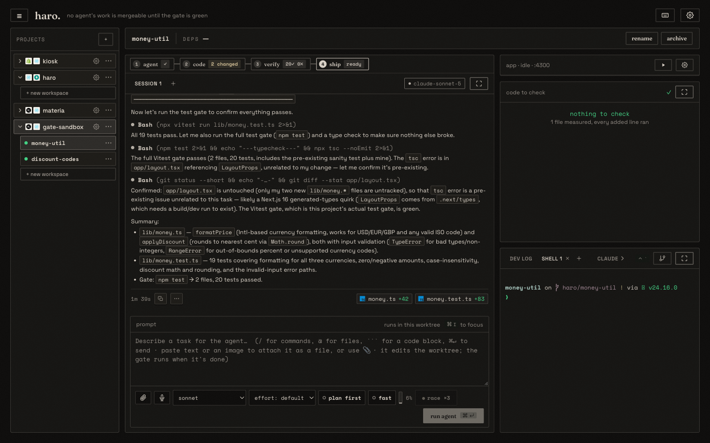
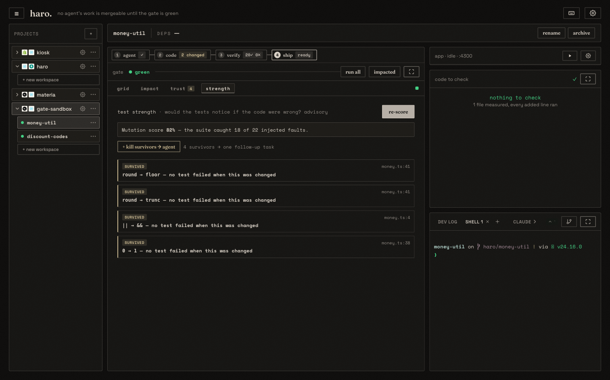
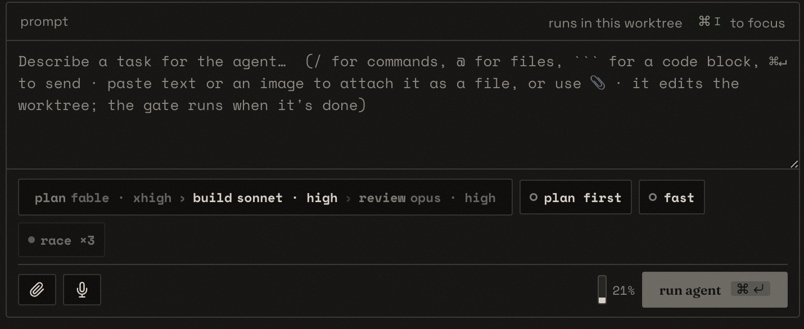
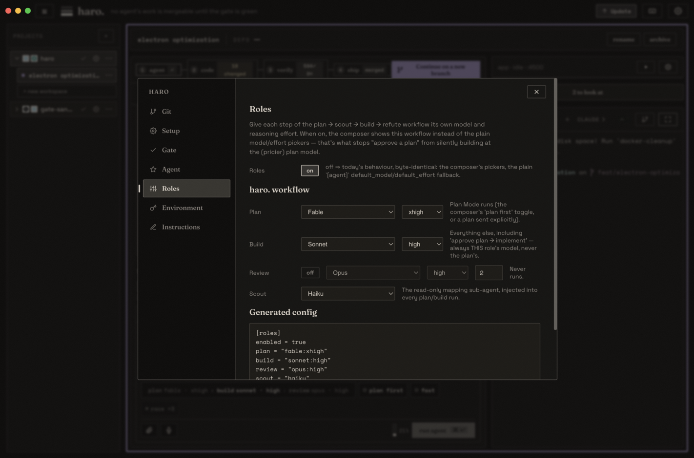
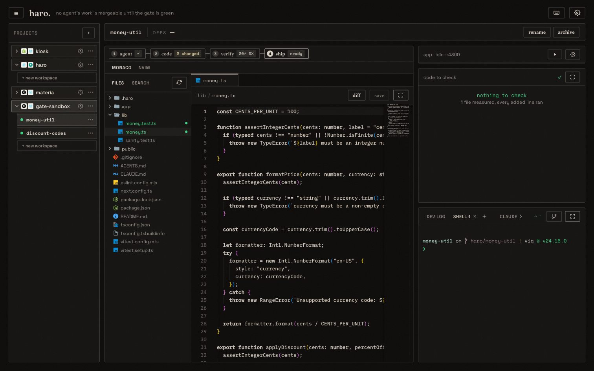
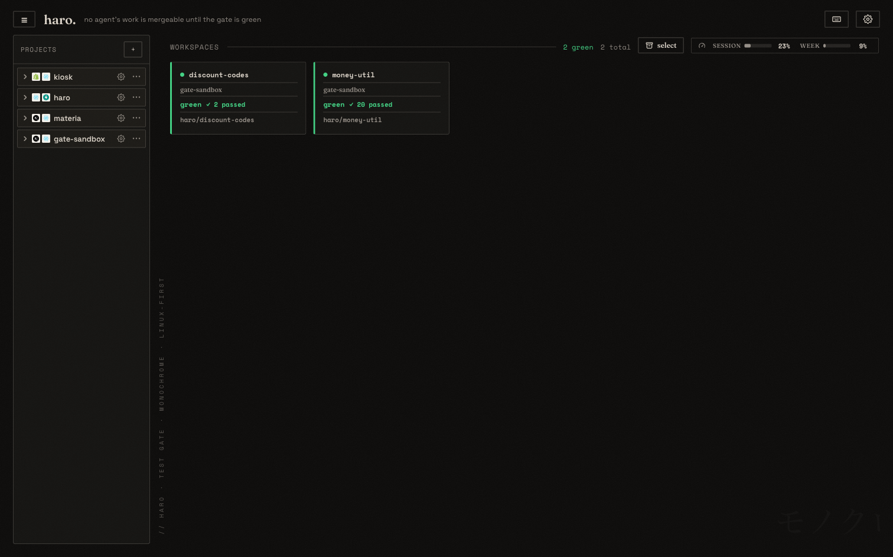

# haro

**The merge gate for agent-written code. It produces proof, not a green tick.**

For the person who has to merge a PR they didn't watch get written: haro runs AI
coding agents in parallel, each isolated in its own **git worktree**, and refuses
to let any of it merge without evidence — not just "tests passed", but whether
those tests could have caught it if the agent were wrong, which lines actually ran
under them, and whether the agent quietly weakened the suite to get there. All of
it watched live in **one window**: agent stream, code editor, terminal, the gate,
and a git/PR panel, no alt-tabbing. See [`CLAUDE.md`](./CLAUDE.md) for the full
product vision and [`CHANGELOG.md`](./CHANGELOG.md) for the live record of what's
shipped.

> **North star: agents write, the gate decides — and it can't be lied to.**



## Three pillars

| Pillar | The question a reviewer actually has | Shipped as |
|---|---|---|
| **Tests that can't be fooled** | Would the suite even notice if this were wrong? Did the agent gut a test to get to green? | mutation strength score + kill-the-survivors loop, tamper alarm, flaky detector |
| **Proof per line** | Which of these 1,200 changed lines actually ran under a passing test? | Verified Hunks, code-to-check, Impact Map, coverage delta |
| **Policy, not vibes** | What's allowed to merge here, and who decided? | the Double Gate (tests + secrets/lint/plan-compliance), conflict-safe merge, the autonomy ladder |

Every claim above is backed by code in this repo, not a roadmap slide — see
`CHANGELOG.md` for when each shipped. Tamper alarm, Verified Hunks, and
conflict-safe merge run **on by default**; mutation score, the Double Gate, and
the autonomy ladder are **opt-in** (they cost an extra test run, a scanner
dependency, or a merge policy you have to choose — see [Config](#config)). The
**Gate Receipt** (below) is where all three pillars land in one artifact a
reviewer can read instead of the diff.

> **Status:** the single-workspace gate is deep (live grid, drill-into-failure,
> Impact Map, coverage delta, flaky detector, mutation score, tamper alarm, the
> Double Gate), the loop is closed (agent → code → gate → ship) and closes back on
> itself (a mutation survivor routes straight back to the agent as a new test to
> write), agents run **in parallel** across worktrees, and the whole thing is a
> **cockpit**: a `① agent › ② code › ③ verify › ④ ship` flow wrapping an embedded
> Monaco editor, a PTY terminal, a git/PR panel, and the gate on the main stage. It
> runs on **SQLite** (no Docker required), ships as a native **Electron app**, and
> the gate itself runs **headless** with no UI at all (`haro gate`, below).
> `CHANGELOG.md` is the source of truth for versions.

## What it does

```
register a local git repo  →  create a workspace (git worktree + branch)
   →  ① run a coding agent inside it (Claude Code or a local model, streamed live)
   →  ② tweak its output in the embedded editor / terminal (no alt-tab)
   →  ③ agent finishes → the gate auto-runs → verify: gate_green / gate_red
   →  ④ ship: read the Gate Receipt → commit → merge (local, or `gh` PR), refused unless green
```

The agent runs with `--permission-mode bypassPermissions`, which is safe because
every agent is boxed inside a disposable worktree branch; the main checkout is
never touched. The gate then enforces the north star: **no merge unless green.**

## The gate: proof, not a green tick

Step **③ verify** starts as a live test grid: cells stream gray → green/red as each
test case finishes (via a custom Vitest reporter emitting NDJSON per case), plus a
slow-test list, wall-time, and an **Impact Map** (the agent's diff → the tests it
provably affects) for a run-impacted-only fast gate. Merge is refused unless it's
green — but green is where the gate *starts* asking questions, not where it stops:

- **Tamper alarm** — a suite that went green by getting *weaker* (tests deleted,
  `.skip`/`.only` added, assertions gutted) is flagged as `green*`, not green.
- **Mutation strength** ("how hard are the tests to fool", a ③ verify on-demand tool) — flips one operator at a time in
  the diff's **added** lines, re-runs the suite, and lists the **survivors**: faults nothing
  caught. One button (**kill-the-survivors**) sends every survivor back to the
  agent as a follow-up task — "write a test that fails on this" — closing the loop
  instead of just reporting it.
- **Verified Hunks** (the ④ ship diff) — every changed line annotated "executed by
  the green suite" vs "never executed", so a big agent diff shrinks to the residue
  nothing actually ran.
- **The Double Gate** — green means tests *and* quality: diff-scoped secrets/lint
  scanning plus an optional LLM plan-compliance check, folded into the same merge
  verdict so a scanner that isn't installed degrades the run instead of silently
  reading clean.
- **The Gate Receipt** — every fact above, plus the agent's model/effort/cost,
  assembled into one markdown block + JSON: the artifact a reviewer reads instead
  of the diff. Posted as a `gh pr comment`, attached as a `git notes` entry on a
  local merge, or read straight off the ship step.



**Bring your own gate.** The gate runs the project's own definition of "correct",
selected per-project via `[gate] runner`:

| Runner | What "green" means |
|--------|--------------------|
| `vitest` (default) | the flagship — live per-case grid, Impact Map, coverage delta |
| `pytest` | pytest via JUnit XML; grid fills from the final snapshot |
| `command` | an arbitrary shell command — exit 0 = green, non-zero = red |
| `offense` | JSON linters (`eslint` / `ruff` / theme-check) — green iff zero error-severity offenses |

That unblocks lint-gated and non-JS stacks without a fake test script.

## Bring your own agent

The `AgentAdapter` seam normalizes every backend to the same five events
(`token · tool_call · file_edit · done · error`), so the UI is identical whichever
you pick — per run, from the composer:

| | Claude Code | Local model |
|---|-------------|-------------|
| Backend | Anthropic (cloud), via the `claude` CLI in `stream-json` mode | Ollama / llama.cpp, OpenAI-compatible `/v1` (haro runs the agentic loop itself) |
| Model | `--model` (opus / sonnet / …) | any local tag (e.g. `qwen2.5-coder`) |
| Reasoning effort | ✓ (`low`…`max`) | passed through |
| Plan Mode (propose, edit nothing) | ✓ | ignored (no plan harness) |
| Fast Mode (speed over depth) | ✓ | — |
| Follow-ups / resume | `--resume` keeps the session | fresh conversation each run |
| Cost guardrail | `--max-budget-usd` | n/a |

Plus per-run controls that survive into the transcript: **Plan first**, **Fast**,
model + effort pickers, cost caps, `.context/` handoff files, and **rewind to
here** — click the ⤺ marker on any of your prompts to truncate the transcript at
that turn and retry it (a checkpoint commit is taken first so nothing is lost).

## haro. workflow: a model per step, not per project

Opt-in `[roles]` gives each step of the **plan → scout → build → refute**
workflow its own model and reasoning effort, so approving a plan can't silently
build at the plan's own (pricier) model. When on, the composer swaps its plain
model/effort pickers for a role strip that shows exactly what will run next:



Configured per-project from Settings → Roles:



- **Plan** — Plan Mode runs (the composer's "plan first" toggle, or a plan sent explicitly)
- **Build** — everything else, including "approve → implement" — always this role's model, never the plan's
- **Review** — the refuter (Phase 3): re-checks a green gate's diff against the approved plan
- **Scout** — a read-only mapping sub-agent (Phase 2), injected into every plan/build run so the driving model isn't burning its own context (or budget) on "where is X"

## The code step: a real editor, in-window

The `② code` step is a full **Monaco** editor (the VS Code engine, bundled locally,
no CDN) over the worktree: syntax highlighting, a Material-icon file tree with
changed-file tinting, image/PDF/markdown preview, and worktree-wide ripgrep search.
The diff view has reviewer controls that never touch the gate — **commit-by-commit
filtering** (step through the branch one own-commit at a time) and a **split /
unified** toggle — with collapsed unchanged regions and scrollbar change markers.



## Parallel agents + the backlog

Agents run **concurrently** across worktrees. The project home ranks every
total` tally, and a **backlog** feeds them work: task-list items parsed from any
markdown under the project's **`backlog/`** folder (or any `*TODO*.md` in the repo),
plus a **GitHub Issues** tab — click an item to open a workspace pre-seeded with it
as the agent's task. Only `- [ ]` lines are clickable tasks; surrounding prose is
kept as notes, and you can **create or edit backlog files in-app**. When several
workspaces are green, a **conflict-aware merge queue** lands them in a conflict-safe
order.



## Architecture

| Piece | Path | Role |
|-------|------|------|
| FastAPI control plane | `backend/haro/main.py` | REST + one WebSocket per workspace + a global feed |
| `AgentAdapter` seam | `backend/haro/adapters/` | `ClaudeCodeAdapter` (cloud) + `LocalModelAdapter` (Ollama/llama.cpp), both normalized to 5 event types |
| `TestRunnerAdapter` seam | `backend/haro/adapters/test_runner/` | `vitest` (live cells via a custom reporter) · `pytest` · `command` · `offense` |
| The gate | `backend/haro/gate.py` | runs the suite, flips `gate_green`/`gate_red`, provisions deps |
| Ship path | `backend/haro/integrate.py` | commit → local merge, or `gh` PR + merge (refused unless green; archive is a separate, explicit step) |
| Git worktree ops | `backend/haro/git_ops.py` | `worktree add` / `diff` / `worktree remove` |
| Lifecycle hooks | `backend/haro/lifecycle.py` | `setup` / `run` / `archive` scripts + per-workspace port allocation |
| Run supervisor | `backend/haro/runner.py` | agent stream → Hub → auto-handoff to the gate |
| Realtime hub | `backend/haro/hub.py` | per-workspace multiplexed pub/sub + global broadcast + backlog replay |
| Persistence | `backend/haro/db.py` | **SQLite** (`aiosqlite`), single file at `~/.haro/haro.db`; hydrated on boot |
| Embedded terminal | `backend/haro/terminal.py` | PTY per workspace over WS ↔ xterm.js |
| React UI | `frontend/src/` | cockpit: flow stepper · agent stream · editor · terminal · gate grid · git panel |

The WebSocket is **multiplexed**: every message is `{channel, …}` where channel is
`agent` (an AgentEvent), `test` (a TestRun snapshot), or `status` (a workspace
status change).

## Prerequisites

- `git` (and optional `gh` for PR-based shipping)
- An agent backend — either the [`claude`](https://claude.com/claude-code) CLI
  authenticated on the host, **or** a local [Ollama](https://ollama.com) / llama.cpp
  server (or both; pick per run)
- Node ≥ 18 if the gate runs Vitest; Python ≥ 3.11 to run the backend from source

No Docker, no Postgres, no cloud OAuth — haro drives your local git (and optional
`gh`) with your own credentials and stores everything in a single SQLite file.

## Run it

**Desktop app (recommended):** build once and it installs as a native app you can
launch from your app menu:

```bash
./desktop/rebuild.sh        # builds the SPA, freezes the backend, installs to ~/.local/opt/haro
```

**Dev / from source:** boot both servers and open a chromeless app window:

```bash
./run.sh                    # backend (:8000) + frontend (:5173) + an app-mode Chrome window
```

Or run the two servers manually (backend hacking without the wrapper):

```bash
# terminal 1: backend
cd backend
python3 -m venv .venv && .venv/bin/pip install -r requirements.txt
PYTHONPATH=. .venv/bin/python -m uvicorn haro.main:app --port 8000

# terminal 2: frontend
cd frontend && npm install && npm run dev    # http://localhost:5173 (proxies to :8000)
```

Then: register a local repo → name a workspace → create the worktree → type a task
(or click a backlog item) → **run agent** → watch it stream, edit, verify, ship.

> The backend runs **without `--reload`** on purpose: it supervises long-lived agent
> subprocesses, and a reload (e.g. a merge writing the source tree) would kill them.
> Pick up backend code changes with an intentional restart.

### Config

**Process-wide** (env vars, set on the backend):

| Env var | Default | Purpose |
|---------|---------|---------|
| `HARO_DB` | `~/.haro/haro.db` | the SQLite file |
| `HARO_WORKTREE_ROOT` | `~/.haro/worktrees` | where workspace worktrees are created |
| `HARO_BROWSE_ROOT` | `~` | root the "add project" folder browser is confined to |
| `HARO_DEPS_CACHE` | `~/.haro/cache` | shared package-manager cache reused across worktrees |

**Per-project**: a committed `.haro/settings.toml`, merged over a gitignored
`.haro/settings.local.toml` (personal overrides) and a user-global layer. Every
worktree inherits it:

```toml
[scripts]
setup       = "npm ci"                             # after worktree create (install deps)
run         = "npm run dev -- --port $HARO_PORT"   # the "Run app" action
archive     = ""                                   # cleanup before archive (optional)
run_mode    = "concurrent"                         # "concurrent" | "nonconcurrent"
login_shell = false                                # run via `$SHELL -lc` so nvm/asdf/pyenv resolve

[gate]
runner        = ""        # "" → vitest (default) | "vitest" | "pytest" | "command" | "offense"
command       = ""        # for runner = "command" / "offense": the shell command to gate with
format        = ""        # for runner = "offense": "theme-check" | "eslint" | "ruff"
dir           = ""        # subdir to run the gate in (monorepo, e.g. "frontend")
default_scope = "all"     # auto-gate scope: "all" | "impacted" (Impact Map fast gate)
merge_result  = false     # gate the worktree merged onto latest base_ref, not the worktree alone

[agent]
adapter       = ""        # "" → claude-code (default) | "claude-code" | "local"
local_model   = ""        # default local model tag when adapter = "local"
default_model = ""        # default model for new runs
default_effort = ""       # low | medium | high | xhigh | max
max_budget_usd = 5.0      # per-run cost cap (0 disables)
max_parallel   = 4        # agents running at once across ALL workspaces (0 = unlimited);
                          # over-cap runs wait as `queued` and start as slots free up

[files]
include = [".env*"]       # gitignored files copied into each new worktree

[ports]
range = [4000, 4999]      # per-workspace port allocated as $HARO_PORT

[roles]
enabled = false           # off ⇒ byte-identical to today: composer's plain model/effort pickers
plan    = ""              # "model:effort", e.g. "fable:xhigh" — Plan Mode's model
build   = ""              # everything else, including "approve -> implement"
review  = ""              # the refuter (Phase 3): re-checks a green gate's diff against the plan
scout   = ""              # read-only mapping sub-agent injected into every plan/build run
```

Scripts receive `$HARO_PORT`, `$HARO_WORKSPACE_PATH`, and `$HARO_ROOT_PATH`.
Secrets live in `.haro/.env` (the Environment tab), seeded into each worktree.
Custom instructions (a standing prompt every run inherits via
`--append-system-prompt`) live in `.haro/instructions.md` (committed) + `.local`
(personal). All of these are editable in-app (the Runbook / project settings).

#### Example: a Shopify theme (no `vitest`, gate on `shopify theme check`)

```toml
[scripts]
setup       = "npm install @shopify/cli@3.94.3"
run         = "npx shopify theme dev --port $HARO_PORT"
login_shell = true

[gate]
runner  = "offense"                       # theme-check emits JSON offenses
command = "npx shopify theme check --output json"
format  = "theme-check"                   # theme-check | eslint | ruff
```

The JSON — not the exit code — is the source of truth: a clean check turns step ③
green and unblocks ④ ship; any **error**-severity offense blocks the merge, while
warnings stay amber (still mergeable). No fake test script needed.

## Headless: `haro gate`

The gate isn't tied to the UI. `haro gate` runs the same gate + Gate Receipt
modules from a shell with no server running — a reviewer's terminal, CI, or
another tool's own automation:

```bash
pip install haro-gate          # or: uvx --from haro-gate haro gate   /   pipx run --spec haro-gate haro gate
haro gate                      # gates the current directory against its detected default branch
haro gate ~/proj --base develop
```

The distribution is `haro-gate` (`haro` on PyPI is an unrelated package); the console
script it installs is still just `haro`.

It prints the Gate Receipt (see [The gate: proof, not a green tick](#the-gate-proof-not-a-green-tick)) as markdown and exits `0` on a
genuine green, `2` on anything the gate measured and found wanting (a red suite,
a tampered one, a blocking quality finding, a degraded check), `1` if the CLI
itself couldn't run (bad path, no adapter). No workspace registration, no
persistence — it points an ephemeral in-memory gate straight at the directory
you give it.

### Portable proof: `--json`, `--attest`, `haro verify`

The receipt doesn't have to stay something only haro's own UI/CLI can read:

```bash
haro gate --json            # the receipt as JSON, for another tool's own parsing
haro gate --attest          # sign it (ed25519, key generated on first use) and save
                             # it under .haro/attestations/ — an in-toto-shaped,
                             # DSSE-signed statement, printed to stdout
haro verify <sha>           # re-check a saved statement's signature against this repo
```

`haro verify` never re-runs the tests — it only proves the saved statement (and
the receipt inside it) hasn't been altered since it was signed: edit one byte of
`.haro/attestations/<sha>.json` and it fails (exit `2`). That's the whole point —
a PR reviewer can check a `Verified-by:` trailer's claim without trusting the
machine that produced it.

### Recipe: gate on every Claude Code stop

Turns platform absorption into a distribution channel — a project using Claude
Code's own native worktrees (no haro UI at all) can still gate on stop. Add to
`.claude/settings.json`:

```json
{
  "hooks": {
    "Stop": [
      { "hooks": [{ "type": "command", "command": "$CLAUDE_PROJECT_DIR/.claude/hooks/haro-gate.sh" }] }
    ]
  }
}
```

`.claude/hooks/haro-gate.sh` (`chmod +x` it):

```bash
#!/bin/sh
# Blocks Claude from stopping until `haro gate` is green. `haro gate`'s own exit
# codes distinguish a red gate (2 — block, keep working) from the CLI itself
# failing to run (1 — a setup problem, e.g. a typo'd path or `haro` not on PATH,
# that retrying won't fix: warn but let Claude stop rather than looping forever).
cd "${CLAUDE_PROJECT_DIR:-.}" || exit 1
output=$(haro gate 2>&1)
rc=$?   # NOT `status` — zsh treats that name as a readonly builtin and errors on assignment
if [ "$rc" -eq 2 ]; then
  echo "$output" >&2   # fed back to Claude as the reason to keep working
  exit 2
elif [ "$rc" -ne 0 ]; then
  echo "haro gate could not run (exit $rc), not blocking on it:" >&2
  echo "$output" >&2
fi
exit 0
```

This deliberately does **not** check `stop_hook_active` to bail early on a red
gate — the whole point is to keep blocking across retries as the agent fixes
what's red. Claude Code's own Stop-hook cap (8 consecutive blocks by default;
raise it with `CLAUDE_CODE_STOP_HOOK_BLOCK_CAP`) is the safety net against a
genuine deadlock, not this script.

### Plugin: the same recipe, packaged (`plugin/`)

`plugin/` bundles the Stop hook above as an installable Claude Code plugin —
one thing to add instead of hand-copying a script into every project. Wires
**`Stop`/`SubagentStop`** to the exact `haro gate` blocking recipe above,
shared by a plain agent and a Task subagent (both hooks share the same
"exit 2 blocks, keep working" contract).

`WorktreeCreate`/`WorktreeRemove` hooks (to keep the Merge Firewall's
adoptable-worktree list live without polling) were built and then **cut**
after review: `WorktreeCreate` is a *replacement* hook, not an observer — it
must itself perform the checkout and return the resulting path, or worktree
creation fails outright, for every project on the machine, not just haro's;
and the natural `WorktreeRemove` handler called an endpoint that force-deletes
the underlying git branch, which is not an acceptable side effect of a
routine "the worktree happened to go away". Revisit as its own properly-scoped
feature, not a footnote on this one.

Try it locally without installing anything: `claude --plugin-dir ./plugin`.
To install for real, host `plugin/` behind a Claude Code plugin marketplace
(`/plugin marketplace add <owner>/<repo>`, then `/plugin install haro-gate`) —
see Claude Code's own plugin docs for the current marketplace workflow, since
that surface moves faster than this README.

### GitHub Action: `haro-gate`

`action.yml` (repo root) runs the CLI in CI and posts the Gate Receipt to the
job summary — a reusable version of the local gate for any project's own CI,
not a replacement for it (haro's whole thesis is that the gate is local and
pre-merge; a CI check is the backstop for work that bypassed it):

```yaml
- uses: actions/checkout@v4
  with:
    fetch-depth: 0   # the gate diffs against base_ref — a shallow clone can't see it
- uses: HaziqLucii/haro@main
  with:
    base: main   # optional — defaults to the repo's own detected default branch
```

Fails the check on anything the gate measured and found wanting (red, tampered,
degraded) — same exit-code contract as the CLI. The receipt posts to the job
summary **even when the gate is red**: a reviewer needs the evidence for the
failure, not just a red X. Requires the `haro-gate` PyPI distribution to be
published (see Housekeeping) — until then, point at a local checkout instead of
`pip install haro-gate` inside the Action, or vendor `backend/` into your own
workflow.

### Recipe: git `pre-push` hook

For a repo that wants `haro gate` enforced on every push with no server, no
plugin, and no CI round-trip — just the CLI. Add to `.git/hooks/pre-push`
(`chmod +x` it):

```bash
#!/bin/sh
haro gate || exit 1
```

That's the whole recipe: `haro gate` exits non-zero on anything but a genuine
green, and a non-zero exit from `pre-push` blocks the push. If your project
already uses the Merge Firewall (`POST /projects/{id}/firewall`) on an adopted
worktree, this is redundant with the hook it installs there — that one carries
a strict/fail-open switch and a bypass for haro's own internal pushes; this
plain recipe is for a repo with no haro workspace at all.

## API surface (representative subset)

```
POST   /projects                              register a local repo
GET    /projects/{id}/detect-stack            sniff the tree → propose gate + scripts
GET    /projects/{id}/todo                     backlog: parse backlog/ + *TODO*.md docs
PUT    /projects/{id}/todo                     backlog: create/edit a backlog file
GET    /projects/{id}/issues                    backlog: assigned GitHub issues (gh)
GET/PUT /projects/{id}/{gate,agent,workflow,env,instructions,scripts}   config
POST   /projects/{id}/merge-queue             conflict-aware merge of all green workspaces
POST   /projects/{id}/workspaces              create workspace (git worktree add)
POST   /workspaces/{id}/agent                 start an agent (adapter / model / effort / plan / fast)
POST   /workspaces/{id}/agent/stop            cancel a running agent
POST   /workspaces/{id}/rewind                rewind the transcript to a turn + prefill composer
GET    /workspaces/{id}/diff                  unified diff vs base_ref
GET    /workspaces/{id}/file[/base]           read a worktree file (working tree or a commit)
PUT    /workspaces/{id}/file                  write a worktree file (the editor)
GET    /workspaces/{id}/search                ripgrep the worktree
POST   /workspaces/{id}/tests[?scope=impacted]  run the gate (all, or impacted-only)
GET    /workspaces/{id}/{impact,history,coverage}  Impact Map · regression ribbon · coverage delta
POST   /workspaces/{id}/{flaky,review}        re-run N× for flakes · advisory AI review over the diff (API only, no UI lane)
POST   /workspaces/{id}/mutation              mutation strength score + survivors (③ verify's Details tools)
GET    /workspaces/{id}/receipt               the Gate Receipt: markdown + JSON evidence packet
POST   /workspaces/{id}/receipt/pr-comment    post the receipt as a `gh pr comment`
POST   /workspaces/{id}/run[/stop]            start / stop the dev server ("Run app")
GET/POST /workspaces/{id}/git/{status,log,commit,pr}   branch state · checkpoint · PR + CI (gh)
POST   /workspaces/{id}/merge                 merge, refused unless gate_green (local merge only: writes a git note w/ the receipt)
POST   /workspaces/{id}/continue              continue a merged workspace on a fresh branch
DELETE /workspaces/{id}                       archive (git worktree remove)
WS     /ws/workspaces/{id}                    live multiplexed stream (agent · test · status)
WS     /ws/workspaces/{id}/terminal/{shell}   PTY ↔ xterm.js
WS     /ws                                    global feed (coarse status/gate/notify for every workspace)
```

## Next

Spec-driven fan-out · richer cost/token metrics. See
[`CHANGELOG.md`](./CHANGELOG.md) (the live record of what's shipped).
