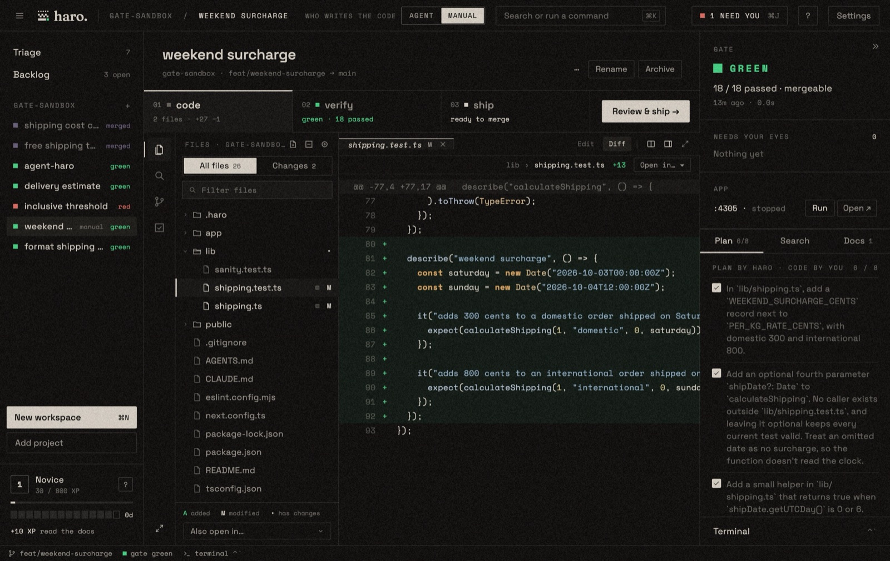
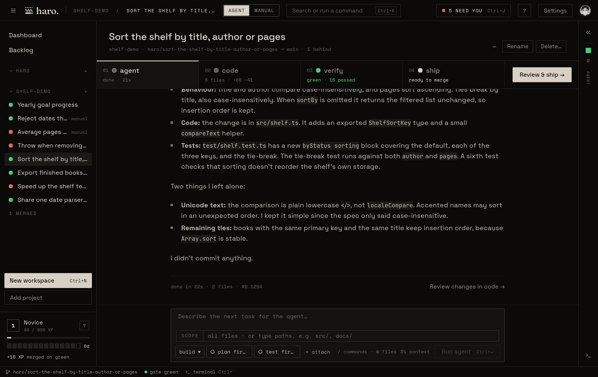
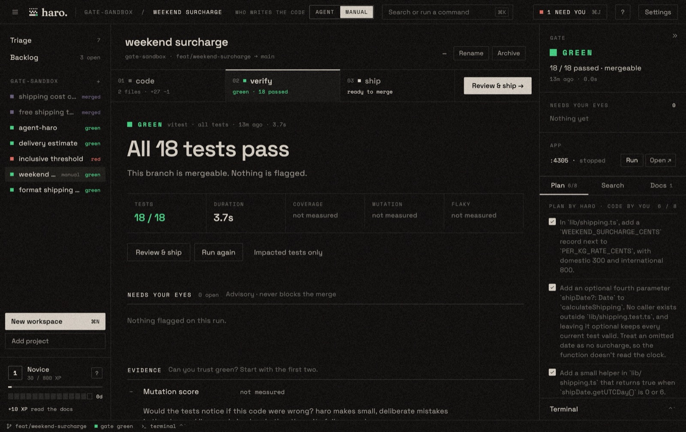
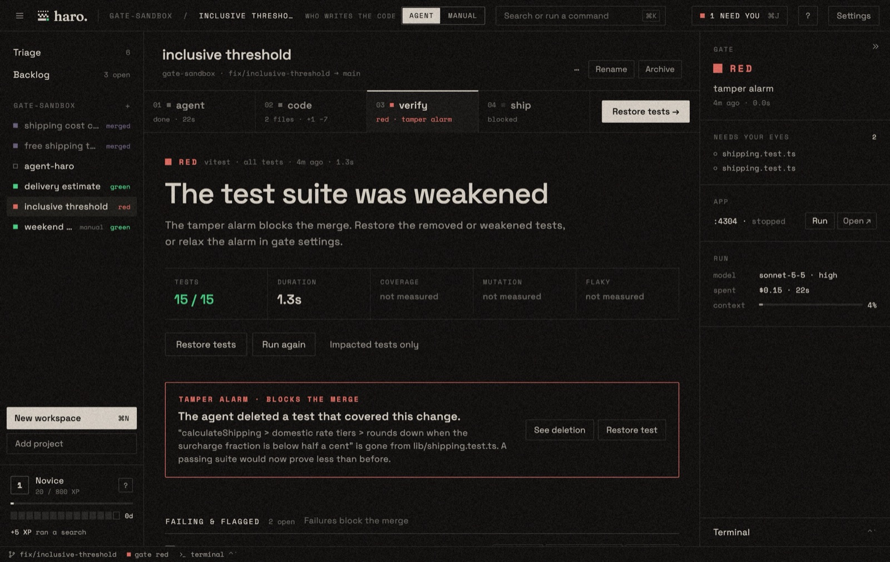
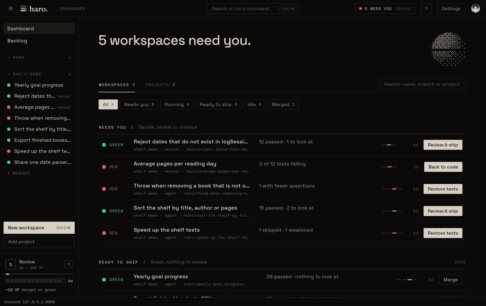

# haro.

**Arise, Developers.**

Some days you'll hand it all to AI. Other days you'll want to write it yourself, the way we used
to. haro is built for both. It's a desktop app where every task gets its own git worktree, and
nothing merges until your own tests pass.

[Website](https://haziqlucii.github.io/haro-site/) ·
[Download for Linux](https://github.com/HaziqLucii/haro-oss/releases/latest) ·
[Changelog](./CHANGELOG.md)



## Two ways to work

Every workspace has a switch at the top: **Agent** or **Manual**. You can flip it whenever you
like, even halfway through a task.

**Manual** is for the days you want to write it yourself. The agent steps aside and you get three
steps: code, verify, ship. haro's assistant is still there in the right-hand rail, but it can only
read your code and the web. It can't touch a single file. Ask it to plan and you get a checklist
with the reason for the order. Ask where something lives and it points you to the file, the
commit or the docs. It won't hand you code to paste. That part is yours.

haro checks your files before and after every answer, so when the receipt says "AI edits: 0", it
means it. If something else was writing at the same time (a test run, a dev server), it says
"unverified" instead.

**Agent** is for when you just need it shipped. Describe the task and the agent works in its own
copy of your repo, streaming every edit and command. When it finishes, the gate runs by itself.
If you switch from Manual to Agent halfway, haro saves your part first, so the receipt shows who
wrote what.



## The gate: your tests decide, not a model

Green means your own test suite passed, on your own machine. That's the only way to merge.

- **Tamper alarm.** If a test gets deleted, skipped or quietly loosened to get to green, haro
  catches it. With `tamper_alarm = "block"` it stops the merge.
- **Lines your tests ran.** Every added line is marked by whether a passing test actually ran it,
  so a big diff shrinks to the part nothing touched.
- **Mutation score.** Wondering if your tests would even notice a bug? Ask for a mutation run: haro
  breaks your new code on purpose, one small change at a time, and lists the changes no test
  caught.
- **Needs your eyes.** Things worth a second look (a new test that already passed before your
  change, a possible secret in the diff) show up for you to tick off. They never block you.
- **The receipt.** Every merge or pull request gets one: the verdict, the test counts, the tamper
  check, and an honest answer to who wrote the code (you, the agent, or both of you).

No AI decides green or red. **Review with AI** on the ship step is there if you want a second
opinion on the diff, but it's advisory and can't block or unblock anything.





## A real editor, and one list for everything

The code step is a small editor built into haro: a file tree, search, tabs, split view, staging per
file and a terminal, right next to your tests. Turn on **run on save** and the gate checks your
work every time you save. When you'd rather use your own editor, **Open in…** hands the file to
Zed, VS Code, Cursor, JetBrains, Sublime, Neovim or Helix at the right line.

Triage puts every workspace across your projects in one list, sorted by what it needs: your
attention, still running, ready to ship, or done.



## Leveling up

Levels, ranks from Novice to Master, a streak and a few badges. It's there for a little fun, a
small pat on the back when your work ships. The big points only come from green merges, and the
best ones go to work done by hand. You can turn it off in Settings.

## Install on Linux

v0.10.0 comes as an AppImage or a tarball, with the backend bundled. You still need `git`, and the
[`claude`](https://claude.com/claude-code) CLI if you want to use the agent or the assistant.

```bash
# AppImage: one file, any distro
curl -LO https://github.com/HaziqLucii/haro-oss/releases/download/v0.10.0/haro-0.10.0-x86_64.AppImage
chmod +x haro-0.10.0-x86_64.AppImage && ./haro-0.10.0-x86_64.AppImage

# or the tarball, which installs a desktop entry and icon into ~/.local
curl -L https://github.com/HaziqLucii/haro-oss/releases/download/v0.10.0/haro-0.10.0-linux-x86_64.tar.gz | tar xz
./haro-0.10.0-linux-x86_64/install.sh
```

The app needs GTK 3, which any desktop distro has. On newer distros the AppImage may need
`libfuse2`, or run it with `--appimage-extract-and-run`. The backend's log is at
`~/.haro/backend.log`.

## Run from source (Linux or macOS)

```bash
# terminal 1: the backend (Python 3.11+)
cd backend
python3 -m venv .venv && .venv/bin/pip install -r requirements.txt
PYTHONPATH=. .venv/bin/python -m uvicorn haro.main:app --port 8000

# terminal 2: the desktop app (Flutter 3.x)
cd app && flutter run -d linux     # or: -d macos
```

The backend keeps everything in one SQLite file at `~/.haro/haro.db` and creates worktrees under
`~/.haro/worktrees`. It runs without `--reload` on purpose, because it looks after long-running
agent processes: restart it to pick up backend changes. To build the Linux release yourself, run
`make linux` (Flutter, `clang cmake ninja-build pkg-config libgtk-3-dev` and Python 3); the files
land in `dist/`.

No Docker, no cloud account, no GitHub app to install. haro drives your local git, your own
Claude Code login, and your own `gh` for pull requests.

## Setting up a project

Add a local git repo in the app and haro looks at it to suggest a test runner and scripts. The
settings live in `.haro/settings.toml` (committed), with personal overrides in
`.haro/settings.local.toml` (gitignored). Everything is also editable in Settings.

```toml
[scripts]
setup = "npm ci"                             # runs when a workspace is created
run   = "npm run dev -- --port $HARO_PORT"   # the "Run app" button

[gate]
runner      = "vitest"   # vitest | pytest | command | offense
command     = ""         # for runner = "command": exit 0 is green
run_on_save = false      # re-run the gate every time you save in the editor
mutation    = false      # allow on-demand mutation runs

[workflow]
tamper_alarm = "warn"    # off | warn | block

[agent]
default_model  = ""      # e.g. "sonnet"
max_budget_usd = 5.0     # per-run cost cap, 0 turns it off
protect_tests  = "off"   # "existing": the agent can't edit tests that already exist

[files]
include = [".env*"]      # gitignored files copied into every new worktree
```

Scripts get `$HARO_PORT`, `$HARO_WORKSPACE_PATH` and `$HARO_ROOT_PATH`. Secrets go in `.haro/.env`
(the Environment tab in Settings). A standing prompt that every agent run inherits goes in
`.haro/instructions.md`.

The gate can run more than tests: `runner = "command"` gates on any shell command, and
`runner = "offense"` reads JSON from a linter (`eslint`, `ruff`, `theme-check`) and goes green when
there are no errors.

## The gate without the app

The same gate runs from a terminal, with no server and no UI. It isn't on PyPI yet, so install it
from this repo:

```bash
pipx install "git+https://github.com/HaziqLucii/haro-oss#subdirectory=backend"
haro gate                     # gate the current directory against its default branch
haro gate ~/proj --base develop
haro gate --json              # the receipt as JSON
```

It prints the receipt and exits `0` on a real green, `2` when the gate found a problem (red,
tampered), and `1` if it couldn't run at all.

**Signed receipts.** `haro gate --attest` signs the receipt and saves it under
`.haro/attestations/`. `haro verify <sha>` checks that signature, and `haro verify <sha> --rerun`
runs the gate again on the attested tree and tells you whether the result matches.

**On every Claude Code stop.** The `plugin/` folder is a Claude Code plugin that runs `haro gate`
when Claude tries to stop, and keeps it working while the gate is red. Try it with
`claude --plugin-dir ./plugin`.

**Before every push.** Put this in `.git/hooks/pre-push` and make it executable:

```bash
#!/bin/sh
haro gate || exit 1
```

**In CI.** `action.yml` runs the gate in GitHub Actions and posts the receipt to the job summary,
even when it's red:

```yaml
- uses: actions/checkout@v4
  with:
    fetch-depth: 0   # the gate compares against your base branch
- uses: HaziqLucii/haro-oss@main
```

## How it's built

| Piece | Where |
|---|---|
| Desktop app (Flutter, Linux and macOS) | `app/` |
| Backend (Python, FastAPI, asyncio, SQLite) | `backend/haro/` |
| The gate and its checks | `backend/haro/gate.py`, `tamper.py`, `mutation.py`, `verified_hunks.py` |
| The Manual-mode assistant | `backend/haro/assist.py`, `research.py` |
| Agents | `backend/haro/adapters/` (Claude Code, or a local model through Ollama or llama.cpp) |
| Test runners | `backend/haro/adapters/test_runner/` (Vitest, pytest, any command, linter JSON) |
| Merging and pull requests | `backend/haro/integrate.py` (local merge, or `gh`) |
| Headless CLI | `backend/haro/cli.py` (`haro gate`, `haro verify`) |

The old React UI (`frontend/`) and Electron shell (`desktop/`) are still in the repo while the
Flutter app replaces them. [`CHANGELOG.md`](./CHANGELOG.md) has the full record of what shipped
and when.

## Status

haro is early. Linux comes first; macOS works from source; Windows isn't supported yet. Offline
framework docs in the assistant aren't built yet (man pages work offline today).

MIT licensed.
